# Gradle + SpringBoot + Travis CI + Coveralls 연동하기

[](https://travis-ci.org/jojoldu/gradle-travisci-coverall) [](https://coveralls.io/github/jojoldu/gradle-travisci-coverall?branch=master)


최근에 개인프로젝트를 진행하면 무조건 진행하는 것이 바로 CI 연동입니다.  
지속적으로 통합 빌드/테스트가 된다는게 개인 프로젝트에서는 정말 큰 도움이 됩니다.  
개인프로젝트에서 CI연동을 하면 다음과 같은 작업이 자동화됩니다.  
  
하나의 기능을 수정 혹은 추가 후 Git Push  
-> Travis CI에서 통합 빌드 및 테스트  
-> Coverall에서 테스트 커버리지 관리  
-> 텔레그램으로 CI 결과 알람  
  
물론 여기서 AWS CodeDeploy나 다른 CD 툴을 사용한면 배포까지 자동화 시킬수 있습니다.  

> 관련된 내용은 [스프링부트로 웹 서비스 출시하기 - 6. TravisCI & AWS CodeDeploy로 배포 자동화 구축하기](http://jojoldu.tistory.com/265)를 참고해보세요!  

앞서 [스프링부트로 웹 서비스 출시하기 시리즈](http://jojoldu.tistory.com/250?category=635883)에서 CI/CD 환경을 소개 드렸는데요.  
여기서 **Coverall로 테스트커버리지 관리, 텔레그램 봇과의 연동** 등이 누락되기도 했었고, 시리즈 전체 없이 단순 Java/Gradle 환경에서 CI연동 방법만 보고 싶으신 분들이 계셔서 정리하게 되었습니다.

> 이번편 다음으로는 **Gradle 멀티 모듈환경에서의 Coverall 연동 방법**을 소개드릴 예정입니다.
  
자 그럼 본격적으로 시작하겠습니다!
  
## 1. 프로젝트 생성 및 Github 연동

> 모든 프로젝트 코드는 [Github](https://github.com/jojoldu/gradle-travisci-coverall)에 있습니다.  

간단한 스프링부트 프로젝트를 생성하겠습니다.  
꼭 스프링부트일 필요는 없으며, Java/Gradle 환경이면 무관합니다.  
프로젝트 생성후, 간단한 코드를 추가하겠습니다.

```java
public class Calculator {
    public static long sum(long num1, long num2){
        return num1+num2;
    }
}

```

그리고 이를 테스트하는 코드를 하나 추가하겠습니다.

```java
import org.junit.Test;

import static org.assertj.core.api.Assertions.assertThat;

public class CalculatorTest {

    @Test
    public void 숫자2개를_더한값이_반환된다(){
        //given
        long num1 = 1;
        long num2 = 2;

        //when
        long sum = Calculator.sum(num1, num2);

        //thwn
        assertThat(sum).isEqualTo(3);
    }
}

```

자 그리고 이 프로젝트를 [Github](https://github.com/jojoldu/gradle-travisci-coverall)과 연동합니다.


> Github 연동이 처음이라면 진유리님께서 만드신 [초심자를 위한 Github 협업 튜토리얼](https://milooy.wordpress.com/2017/06/21/working-together-with-github-tutorial/)를 참고해보세요!

자 그럼 이제 **테스트 코드가 포함된 Gradle 프로젝트가 Github**에 올라갔습니다!  
본격적으로 연동 작업을 시작해보겠습니다.

## 2. Travis CI 연동

[Travis CI](https://travis-ci.org/)로 접속합니다.  
로그인 하신뒤, 본인의 프로필 페이지로 이동합니다.

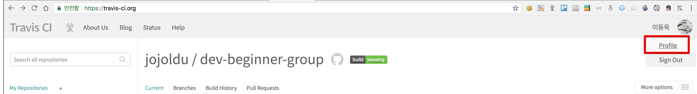

방금 올린 저장소를 검색해서 찾아 아래와 같이 활성화시킵니다.

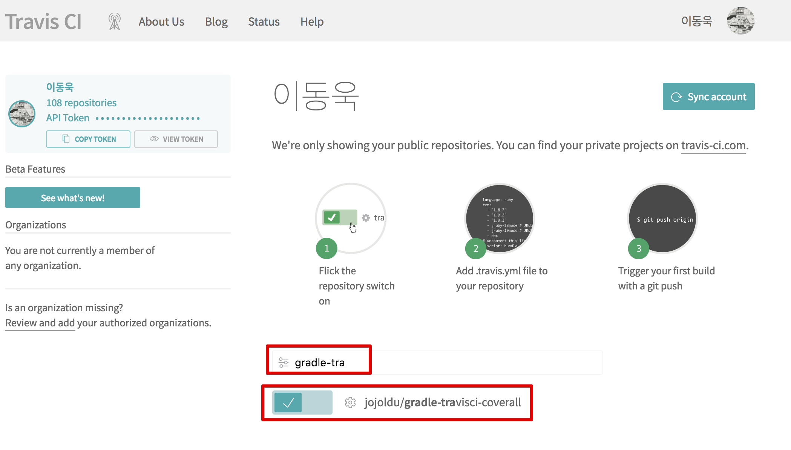

그리고 프로젝트에 ```.travis.yml``` 파일을 생성해서 아래 내용을 추가합니다.

```yml
language: java
jdk:
  - openjdk8

branches:
  only:
    - master

# Travis CI 서버의 Cache 활성화
cache:
  directories:
    - '$HOME/.m2/repository'
    - '$HOME/.gradle'

# clean 후 Build (Build시 자동으로 test 수행)
script: "./gradlew clean build"
```

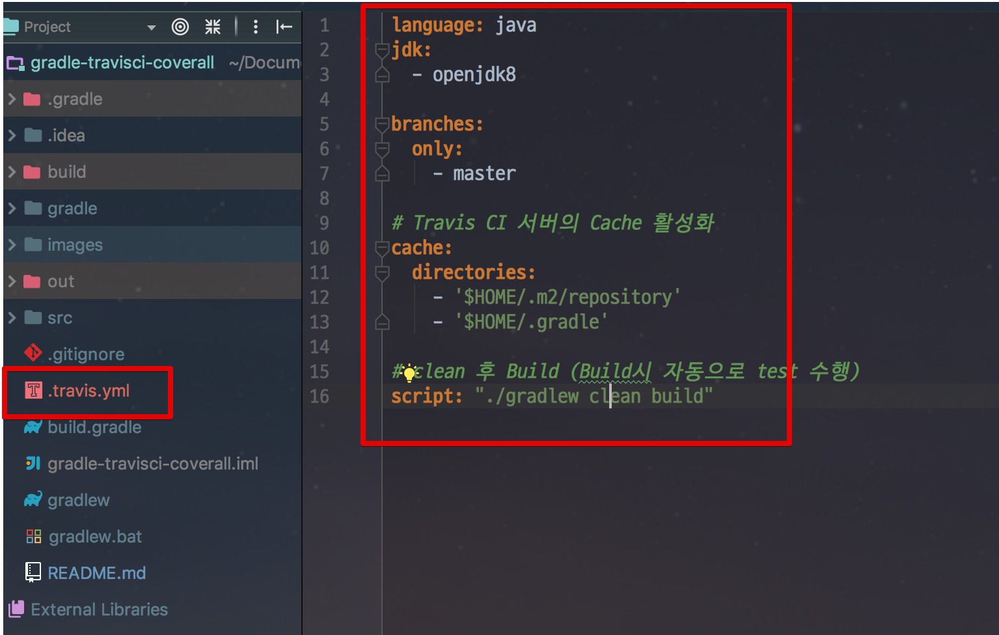

여기까지 하셨다면 바로 Git Commit & Push 합니다.  
그리고 다시 Travis CI로 가보시면!

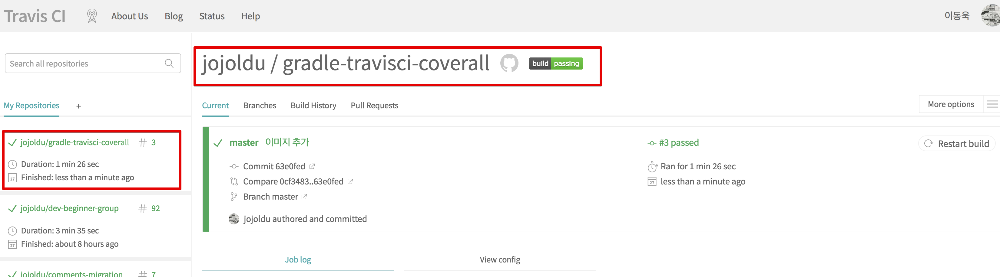

**빌드가 성공적으로 수행**됐음을 알 수 있습니다.  
이제는 Master 브랜치로 Push 할때마다 Travis CI에서 빌드가 계속 수행될 것입니다.  

> develop 브랜치로 변경하길 원하시면 .travis.yml에서 **branches에서 master 부분을 develop으로 변경**하시면 됩니다.

그리고 빌드 상태 라벨을 복사해서 Github 프로젝트에 추가합니다.

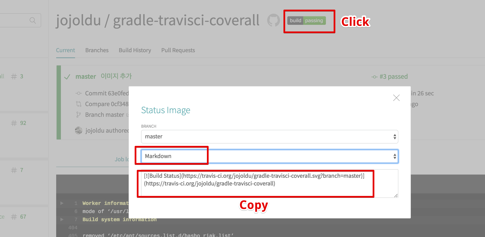

여기서 복사한 코드를 프로젝트 안의 README.md에 붙여넣습니다.

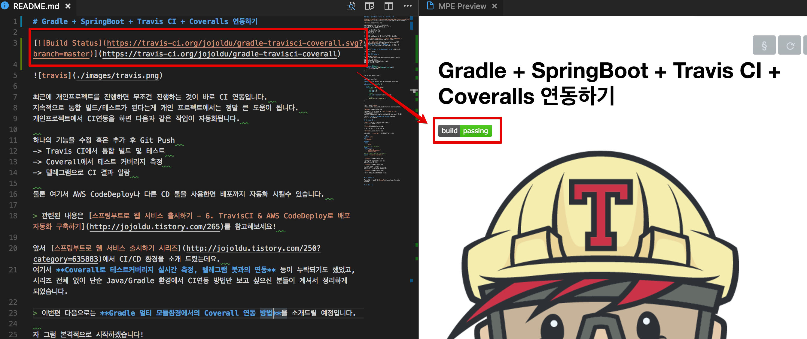

이것도 마찬가지로 push를 하시면!

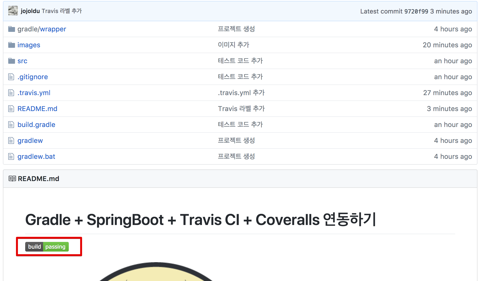

Github에 성공적으로 반영 되었습니다.

## 3. Coverall 연동

Travis CI와 연동된 프로젝트를 바로 [Coveralls](https://coveralls.io/)와 연동해보겠습니다.  
Coveralls는 Travis CI와 연동해서 **테스트 커버리지를 관리해주는 웹 서비스**입니다.  
즉, Travis CI에서 테스트 커버리지 측정 도구 (ex: jacoco)를 실행해서 coveralls로 결과를 전송하면 이 결과를 통계로 남기고 보여주는 서비스 입니다.  
이 측정치가 높으면 높을수록 견고한 프로젝트임을 알 수 있겠죠?  
(물론 테스트 커버리지가 전부일순 없습니다^^;)  
  
[사이트](https://coveralls.io)로 접속해서 메인화면의 좌측에 있는 **GET STARTED FOR FREE**을 클릭합니다.  

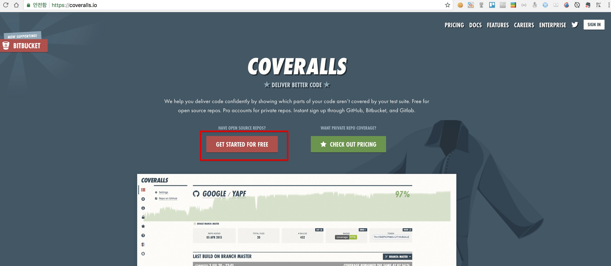

Github 으로 로그인합니다.

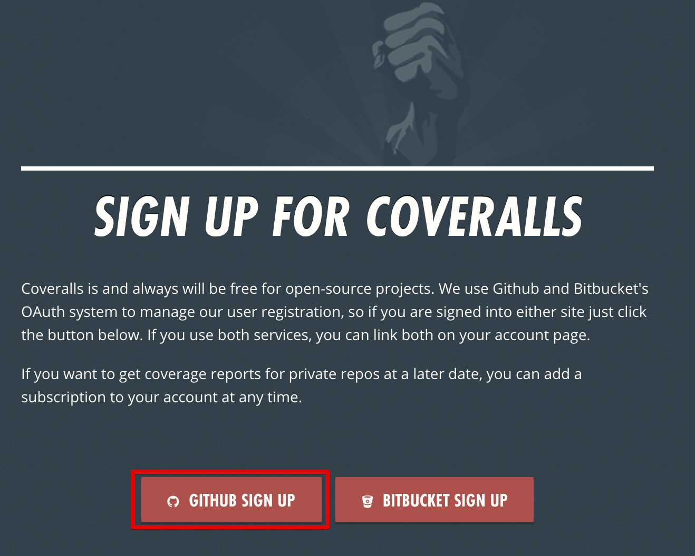

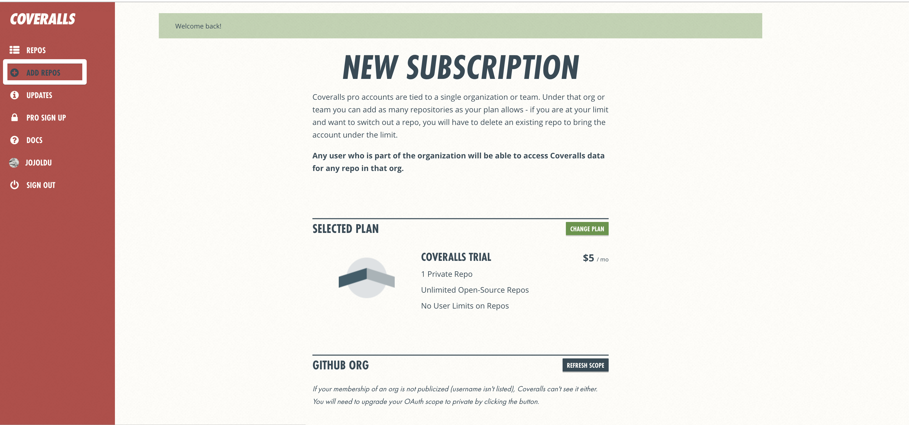


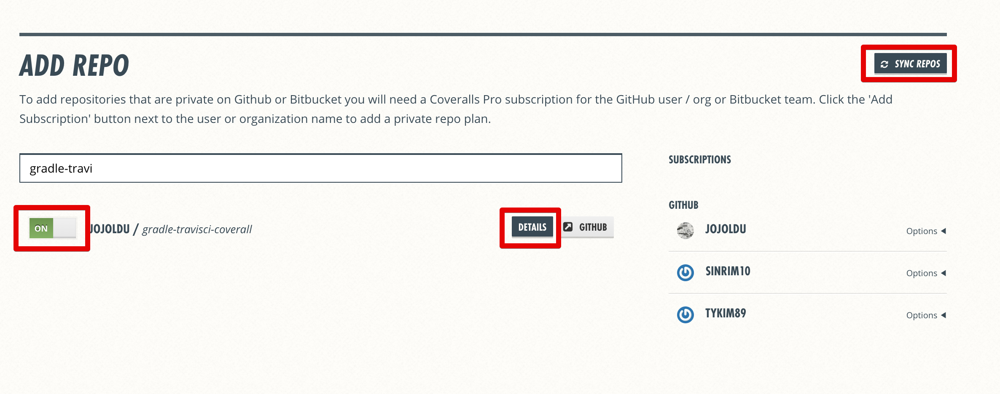

**Details** 버튼을 클릭하면 아래와 같이 기본 가이드가 보입니다.  
여기서 ```repo_token: 토큰값``` 이 있는 부분을 복사합니다.

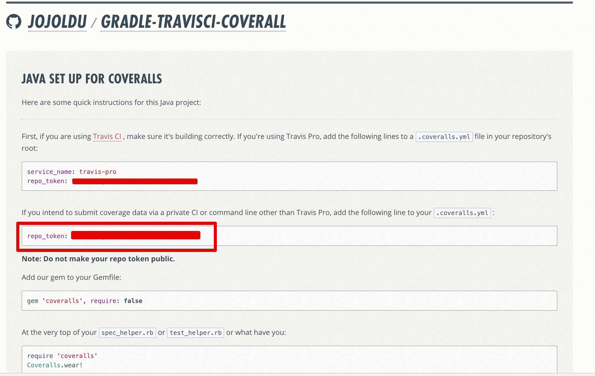

그리고 프로젝트에 ```.coveralls.yml```을 생성해서 복사한 내용을 그대로 추가합니다.

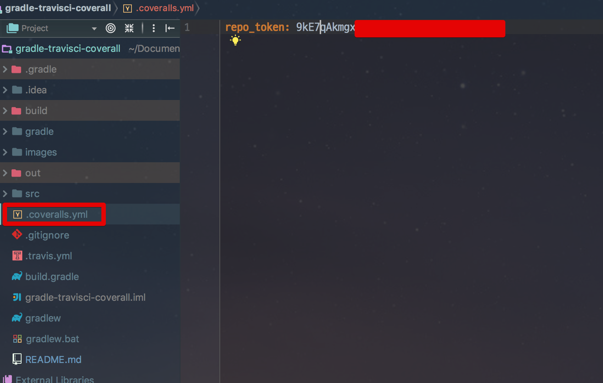

자 연동은 완료되었으니 이제 테스트 커버리지를 측정할 도구를 Gradle에 추가하겠습니다.  
우리가 사용할 도구는 바로 [jacoco](http://www.eclemma.org/jacoco/) 입니다.  

> coveralls는 결국 직접 테스트 커버리지를 측정하진 않습니다.  
프로젝트에 내장된 측정도구를 Travis CI에서 사용해서 coveralls 사이트로 전송해야만 합니다.  

jacoco를 사용해 coveralls로 전송해야하기 때문에 Gradle의 플러그인을 하나 추가하겠습니다.  
추가할 플러그인은 [coveralls-gradle-plugin](https://github.com/kt3k/coveralls-gradle-plugin) 입니다.  

프로젝트의 build.gradle에 다음과 같은 코드를 추가합니다.

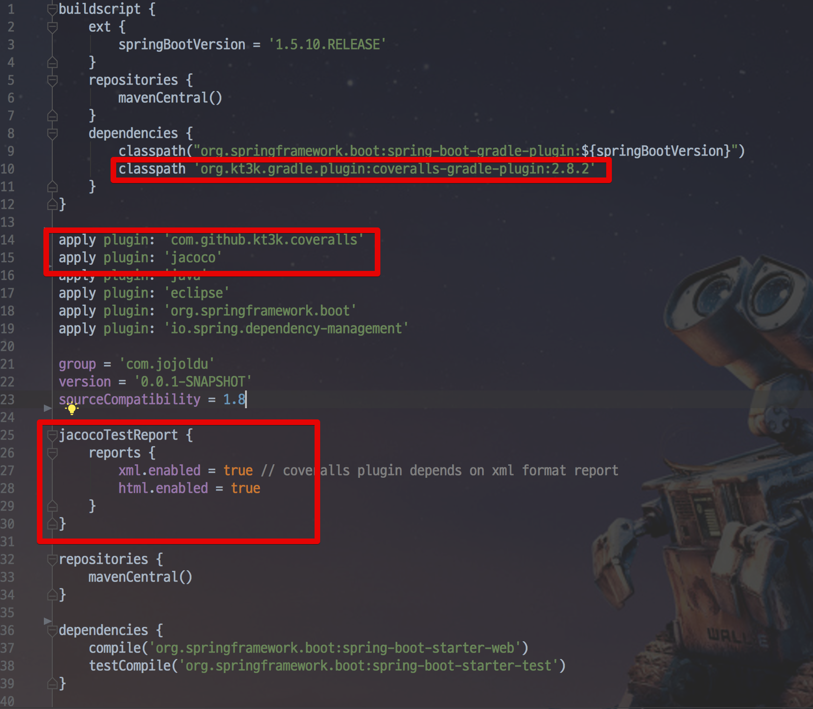

```yml
buildscript {
    ...
	dependencies {
        ...
        classpath 'org.kt3k.gradle.plugin:coveralls-gradle-plugin:2.8.2'
	}
}

apply plugin: 'com.github.kt3k.coveralls'
apply plugin: 'jacoco'

...

jacocoTestReport {
	reports {
		xml.enabled = true // coveralls plugin depends on xml format report
		html.enabled = true
	}
}

...

```

자 이렇게까지 하시면 완료 됩니다.  
바로 Github으로 Push 해봅니다.  
Travis CI의 빌드가 끝난뒤 coveralls 사이트를 방문해보시면!

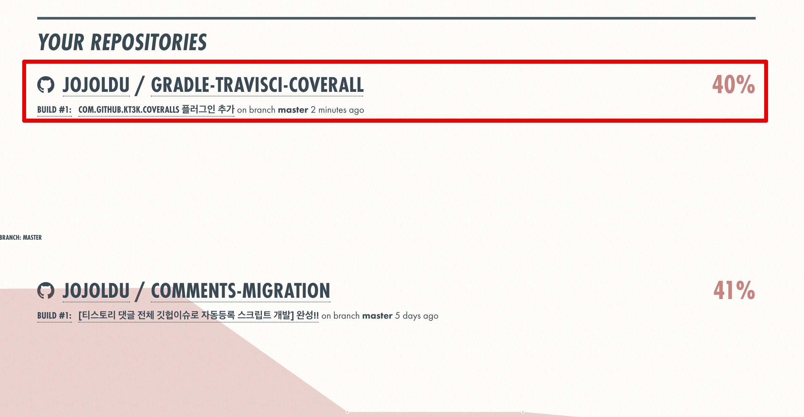


테스트커버리지가 출력 되는걸 알 수 있습니다.  
프로젝트를 클릭해서 들어가보시면 자세한 상세 통계가 나옵니다.


Coveralls까지 연동했으니 라벨을 추가하겠습니다.  
BADGE의 **EMBED**를 클릭합니다.

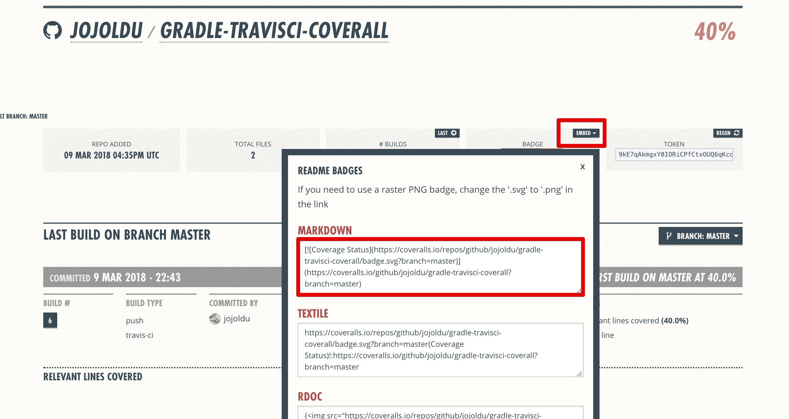

마크다운 코드를 복사해서 README.md에 추가합니다.

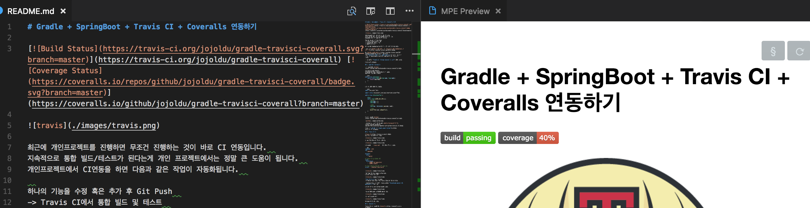

최종 수정후 Github으로 Push 해보시면!

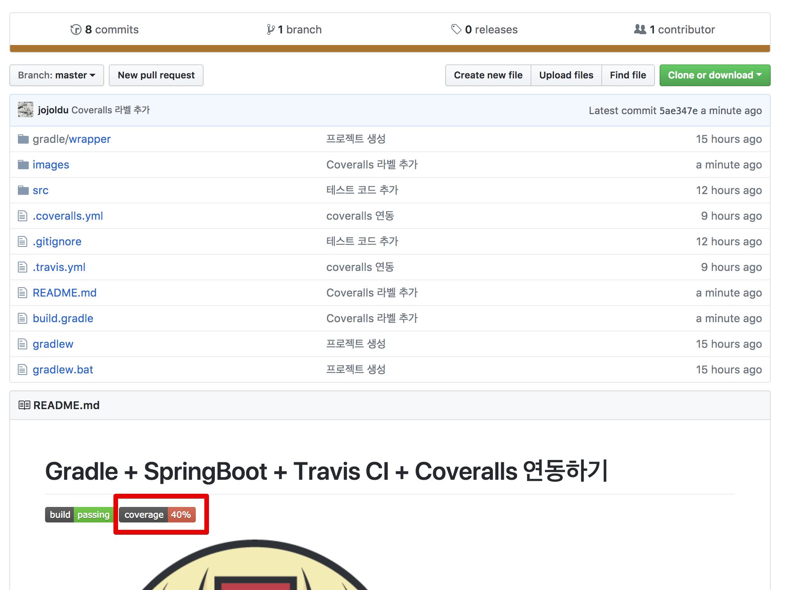

Coveralls 라벨도 추가되었습니다!

> 좀 더 자세한 내용은 [outsider님의 포스팅](https://blog.outsider.ne.kr/954)을 참고해보세요!

## 4. 텔레그램 봇 연동
  
Travis CI를 통해서 빌드를 하기 때문에 성공/실패 알람을 받아야하는데요.  
기본적인 방법은 메일을 통해 받는것이지만, 메일은 아무래도 잘 확인을 안하게 되어서 다른 메신저를 통해서 알람을 받습니다.  
대중적인 방법은 슬랙인데, 슬랙이 아무래도 네이티브 앱이 아닌지라 속도가 많이 느려 개인적으로 선호하진 않습니다.  
그래서 최근에는 [텔레그램](http://www.telegram.pe.kr/)을 사용하고 있습니다.  
텔레그램 설치와 가입은 여기서는 생략하겠습니다.  
  
텔레그램 봇 스토어에서 Travis CI 봇을 찾습니다. [링크](https://storebot.me/bot/travisci_build_bot)  
  
좌측의 **Add To**를 클릭합니다.


앱이 열리면서 Travis CI 봇의 안내에 따라 진행하시면 됩니다.

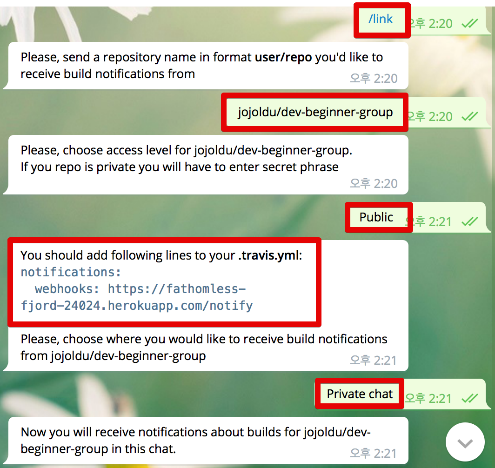

여기서 깃헙 주소는 전체가 아닌 **username/repository이름** 으로 하시면 됩니다.  
가이드대로 다 하셨으면 다시 프로젝트의 ```.travis.yml``` 에 코드를 추가합니다.

```yml
notifications:
    webhooks: https://fathomless-fjord-24024.herokuapp.com/notify
```


자 여기까지 다하셨으면 바로 Github으로 Push 해봅니다.  
그러면!


텔레그램으로 빌드 성공 메세지가 전달됩니다.  

## 마무리

이제는 개인프로젝트를 진행하면서도 **빌드 & 테스트 & 테스트커버리지 통계 & 빌드 성공/실패 알람** 이 모든것이 자동화되서 진행됩니다!  
조금더 완성도 높은 개인 프로젝트를 진행하시는데 도움이 되지 않을까 생각합니다.  
별거 아닌 내용이지만 실제로 적용하면 개인에겐 크게 도움이 되니 꼭꼭 적용해보시길 추천드립니다.  
다음에도 유용한 정보 공유드리겠습니다.  
끝까지 봐주셔서 감사합니다!!
  
